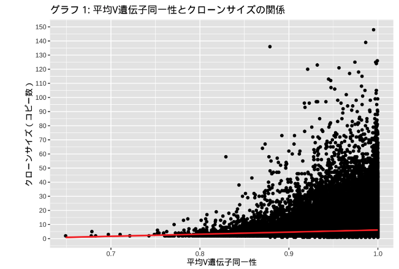
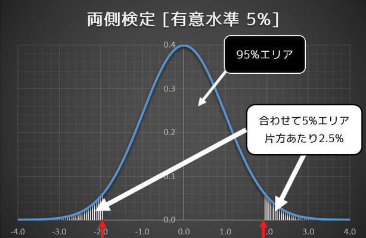
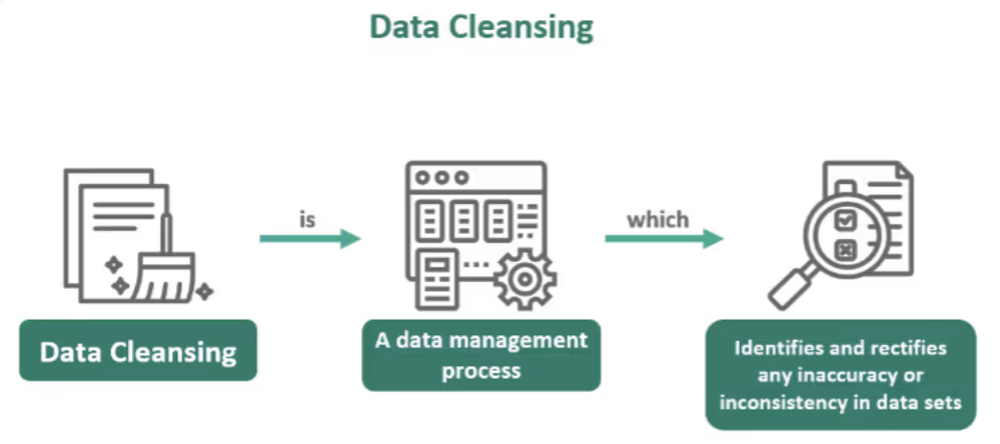

#　石橋　尚子（イシバシ　ナオコ）
# データアナリスト/ データ分析
[職務経歴書](https://github.com/naokoi0408/Portfolio.Japanese-ver/blob/main/assets/%E8%81%B7%E5%8B%99%E7%B5%8C%E6%AD%B4%E6%9B%B8.pdf)
#### 技術スキル: R, SQL, Java, Python

## 学歴
- ペンシルベニア大学 | データ分析 & 社会科学学士（2024年8月）
- フィラデルフィア・コミュニティカレッジ | コンピュータサイエンス準学士（2021年5月）

## 経歴
データアナリスト兼プログラマーインターン @ Senior Grooming (2023年8月～現在)

- Rを活用して人口データを分析し、地理情報を基に戦略的な事業拡大を支援するレポートを作成。
- Javaを使ってSendGridとのAPI統合をプログラミングし、トランザクションメールの管理を効率化。
- SendGridでカスタムメールテンプレートを作成し、ユーザー体験の向上とブランドの一貫性を実現。

## 認定資格
- Introduction to Database and SQL, Great Learning（2024年6月）
- Microsoft Power BI,Microsoft                     (2025年02月 取得見込み)
  
## プロジェクト
### ベースRによる回帰分析
[公開資料](https://github.com/naokoi0408/Portfolio.Japanese-ver/blob/main/assets/%E5%9B%9E%E5%B8%B0%E5%88%86%E6%9E%90%20%20Regression%20Analysis%20%20.pdf)

2020年米国全国選挙調査データを対象に、民主党に対する有権者の感情を評価するための回帰分析を実施。サンプリング理論を適用し、データのクリーニングと視覚化を行い、結果を要約。
- スキル: R、統計、データビジュアライゼーション

### 糖尿病研究分析
[公開資料](https://github.com/naokoi0408/Portfolio.Japanese-ver/blob/main/assets/Analysis%20Project%20%E6%97%A5%E6%9C%AC%E8%AA%9E.pdf)

2万行のデータを分析し、健康なサンプルと糖尿病サンプルにおけるクローンサイズと突然変異の相関関係を調査しました。仮説検定を実施し、糖尿病患者では平均クローンサイズが顕著に増加するという有意な結果を確認しました。また、6人のドナーにおけるV遺伝子の使用傾向を棒グラフで可視化し、糖尿病サンプルでより高い値が見られることを示しました。この研究は、1型糖尿病のリスク予測および予防に役立つ可能性のある要因を示唆しています。
- スキル: R、統計、仮説検定、データビジュアライゼーション

### R-Shinyアプリ開発
[公開資料](https://github.com/naokoi0408/Portfolio.Japanese-ver/blob/main/assets/%E5%AD%A6%E6%A0%A1%E3%83%A9%E3%83%B3%E3%82%AD%E3%83%B3%E3%82%AF%E3%82%99%E3%82%A2%E3%83%95%E3%82%9A%E3%83%AA%E3%81%AE%E8%AA%AC%E6%98%8E.pdf)

Leafletウィジェットを用いたShinyアプリケーションを開発。フィラデルフィアの学校とLEAデータセットを対象に、出席率に基づくランキングを表示。SQLとRの統合による高度な地理分析を実現。
- スキル: R、Shiny、データビジュアライゼーション、UI/UX

### SQLデータプロジェクト
[公開資料](https://github.com/naokoi0408/Portfolio.Japanese/blob/main/assets/SQL_Japanese%20ver.pdf)

企業規模別の年間中央値給与を比較分析。社員数1000人規模の企業では$250,000～$260,000、さらに大規模な企業では$268,000～$275,000と、規模が大きくなるにつれて給与が増加する傾向を発見。
- スキル: SQL、データベース管理、データ変換

### 仮説検定と推定量分析
[公開資料](https://github.com/naokoi0408/Portfolio.Japanese/blob/main/assets/%E4%BB%AE%E8%AA%AC%E6%A4%9C%E5%AE%9A%E3%81%A8%E6%8E%A8%E5%AE%9A%E9%87%8F%E5%88%86%E6%9E%90.pdf)

これらの回帰分析における仮説検定は、教育水準や地域といった独立変数が、中央値の所得や通勤行動といった従属変数に統計的に有意な影響を与えるかを評価します。観察された関係が偶然によるものかどうかを検証し、帰無仮説では「影響がない」と仮定し、対立仮説では「有意な影響がある」と仮定します。
- スキル: 統計、R、仮説検定

### データクリーニングと変換
[公開資料](https://github.com/naokoi0408/Portfolio.Japanese/blob/main/assets/%E3%83%86%E3%82%99%E3%83%BC%E3%82%BF%E3%82%AF%E3%83%AA%E3%83%BC%E3%83%8B%E3%83%B3%E3%82%AF%E3%82%99.pdf)

このプロジェクトでは、dplyrを用いたデータクリーニングと分析に取り組みました。具体的な作業には、キャンセルされていないフライトの抽出、遅延パターンの分析、遅延が多い航空会社や目的地の特定が含まれます。追加のタスクとして、データの偏りを考慮しながら野球の打率を調査しました。
- スキル: R、SQL、データ整形、データセットのクレンジング

### 確率変数分析
[公開資料](https://github.com/naokoi0408/Portfolio.Japanese/blob/main/assets/%E7%A2%BA%E7%8E%87%E5%A4%89%E6%95%B0%E5%88%86%E6%9E%90.pdf)

このプロジェクトでは、Rを用いて一連の統計解析とシミュレーションを行いました。正規分布の確率と信頼区間を計算し、サイコロのロールをシミュレーションしてヤッツィに関連する確率を探求し、コイン投げのデータを分析して連続した結果の長さを推定しました。この作業では、正規分布の累積分布関数（CDF）やモンテカルロシミュレーションなどの統計手法を適用し、有意義な洞察を導き出し、結果をグラフで可視化しました。このプロジェクトは、データ分析、統計モデル作成、シミュレーションのスキルを示しています。
- スキル:　データ分析、統計モデリング、シミュレーション

